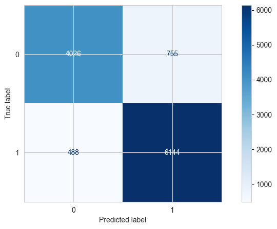
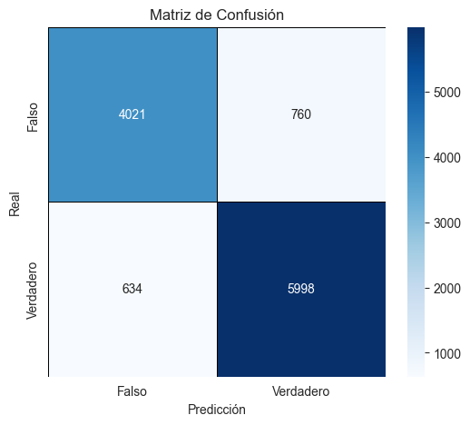

# mDescripción general de resultados

## Regresión logística

Se utilizó un modelo de **Regresión Logística** con un umbral de **0.6** para clasificar noticias en **falsas (0) y verdaderas (1)**. Los resultados finales muestran un **rendimiento sólido con un balance adecuado entre precisión y recall** .

| **Métrica**                         | **Valor** |
| ------------------------------------------ | --------------- |
| Exactitud                                  | 89.1%           |
| Precisión (Clase 0 - Noticias Falsas)     | 89%             |
| Precisión (Clase 1 - Noticias Verdaderas) | 89%             |
| Recall (Clase 0 - Noticias Falsas)         | 84%             |
| Recall (Clase 1 - Noticias Verdaderas)     | 93%             |
| F1-Score (Clase 0 - Noticias Falsas)       | 87%             |
| F1-Score (Clase 1 - Noticias Verdaderas)   | 91%             |

### Resumen

* Alta exactitud (89.1%) lo que indica que el modelo clasifica correctamente la mayoría de las noticias.
* Balance entre precisión y recall en ambas clases (89% de precisión en ambas clases).
* Recall alto en la detección de noticias verdaderas (93%), lo que significa que la mayoría de las noticias legítimas son correctamente identificadas.
* Recall razonablemente alto en la detección de noticias falsas (84%), evitando que muchas noticias falsas pasen como verdaderas.

### Análisis de la matriz de confusión

#### Valores clave de la matriz de confusión

##### Interpretación

- **4,026** noticias **falsas** fueron **correctamente identificadas** como **falsas** (Verdaderos Negativos - TN).
- **6,144** noticias **verdaderas** fueron **correctamente clasificadas** como **verdaderas** (Verdaderos Positivos - TP).
- **755** noticias falsas fueron **clasificadas erróneamente** como **verdaderas** (Falsos Negativos - FN).
- **488** noticias **verdaderas** fueron **clasificadas erróneamente** como falsas (Falsos Positivos - FP).

##### Conclusiones

Por un lado, la tasa de error es baja , ya que el modelo tiene más verdaderos positivos y negativos que errores. Por otro lado, hay más falsos negativos (noticias falsas clasificadas como verdaderas) que falsos positivos (noticias verdaderas clasificadas como falsas). Esto sugiere que el modelo prioriza la detección de noticias verdaderas, pero sigue siendo confiable para detectar noticias falsas.

### ¿Cómo aportan estas métricas a los objetivos del negocio?

El objetivo del modelo es **detectar noticias falsas con alta precisión y recall,** asegurando que la herramienta pueda ser utilizada para mejorar la verificación de información y la toma de decisiones estratégicas.

#### Impacto positivo en la organización

Uno de los impactos más positivos del modelo de regresión logística es que demuestra una alta precisión y recall, lo que ayuda a reducir la propagación de desinformación. Adicionalmente, las métricas muestran que el modelo tiene confianza en sus predicciones, reduciendo el riesgo de errores. Por último, utilizando este modelo es posible priorizar revisiones manuales en noticias dudosas, mejorando la eficiencia del equipo de fact-checking.

#### Riesgos y consideraciones

El principal riesgo que encontramos radica en que aún hay falsos negativos, lo que significa que algunas noticias falsas podrían ser clasificadas como verdaderas y propagarse. Para corregir esto, es necesrio bajar el umbral para aumentar el recall en la clase 0.

#### ¿Qué significa cambiar el umbral?

El **umbral de clasificación** es el valor a partir del cual el modelo decide si una noticia es  **falsa (0) o verdadera (1).** Como el modelo de regresión logística utiliza **clasificación binaria**, este genera una **probabilidad** entre **0 y 1** de que una una noticia sea verdadera.

* Por defecto, el umbral es **0.5**, lo que significa:
  * **Si la probabilidad es ≥ 0.5** , la noticia se clasifica como **verdadera** .
  * **Si la probabilidad es < 0.5** , la noticia se clasifica como **falsa** .

En el caso puntual de este proyecto, el umbral utilizado es de 0.6.

#### ¿Cómo afectó esto al modelo?

**Comparación antes y después del cambio de umbral:**

| **Métrica**                | **Antes (Umbral 0.5)** | **Después (Umbral 0.6)** |
| --------------------------------- | ---------------------------- | ------------------------------- |
| Precisión (Clase 0 - Falsas)     | 80%                          | 89% ⬆                         |
| Precisión (Clase 1 - Verdaderas) | 82%                          | 89% ⬆                          |
| Recall (Clase 0 - Falsas)         | 73%                          | 84% ⬆                          |
| Recall (Clase 1 - Verdaderas)     | 87%                          | 93% ⬆                          |
| F1-Score (Clase 0 - Falsas)       | 76%                          | 87% ⬆                          |
| F1-Score (Clase 1 - Verdaderas)   | 84%                          | 91% ⬆                          |
| Exactitud (Accuracy)              | 81%                          | 89% ⬆                          |

Notamos que el impacto principal se puede describir en 3 componenentes. En primer lugar, aumentó la precisión en ambas clases, lo que significa que cuando el modelo predice una noticia como verdadera o falsa, lo hace con mayor certeza. Adicionalmente, mejoró el recall en ambas clases, lo que indica que el modelo detecta más noticias correctamente. Por último, se redujo la cantidad de noticias clasificadas incorrectamente, reduciendo falsos positivos y falsos negativos.

#### Impacto de cambiar el umbral en términos de beneficios para la organización

**1. Mayor confianza en la detección de noticias falsas**

Al reducir los falsos negativos, se disminuye la probabilidad de que una noticia falsa pase desapercibida y se propague. Esto puede ayudar a la organización a combatir la desinformación de una forma más efectiva.

**2. Menos censura de noticias legítimas**

Al reducir los falsos positivos, el modelo evita etiquetar noticias verdaderas como falsas. Esto permite que el modelo se use en plataformas de verificación de noticias sin afectar la credibilidad de fuentes legítimas.

**3. Mejor rendimiento general**

El aumento en el umbral permitió un equilibrio entre la precisión y el recall. Esto asegura que la herramienta sea confiable y pueda integrarse en flujos de trabajo de verificación sin generar demasiados errores.

### Conclusiones sobre el modeo de regresión lógica

#### Conclusiones generales

**¿Es este modelo adecuado?** - Sí, ya que mantiene un buen balance entre detección de noticias falsas y reducción de errores

**¿Debería ajustarse más?** - Depende del contexto de uso. Si la prioridad es minimizar la propagación de noticias falsas, podríamos bajar un poco el umbral para mejorar el recall de la clase 0.

**¿Es útil para la organización?** - Sí, ya que ofrece un sistema confiable para ayudar en la detección automática de desinformación.

#### Conclusiones sobre el ajuste del umbral

El  **ajuste del umbral de 0.5 a 0.6 mejoró significativamente la precisión y el recall del modelo** , reduciendo los errores más críticos:

1. El modelo ahora es más confiable y preciso.
2. Minimiza la propagación de noticias falsas sin censurar en exceso noticias legítimas.
3. Mejora la utilidad del sistema para la organización y su impacto en la lucha contra la desinformación.

---

## **Red neuronal**

Se usó una red neuronal con un umbral de **0.5** para clasificar las noticias **falsas y verdaderas**. Los resultados muestran un **buen rendimiento** con un **balance entre precisión y recall**.

| **Métrica**                         | **Valor** |
| ------------------------------------------ | --------------- |
| Exactitud                                  | 87.31%          |
| Precisión (Clase 0 - Noticias Falsas)     | 84%             |
| Precisión (Clase 1 - Noticias Verdaderas) | 89%             |
| Recall (Clase 0 - Noticias Falsas)         | 84%             |
| Recall (Clase 1 - Noticias Verdaderas)     | 90%             |
| F1-Score (Clase 0 - Noticias Falsas)       | 84%             |
| F1-Score (Clase 1 - Noticias Verdaderas)   | 89%             |

### **Resumen**

- El modelo presenta una precisión del **84%** para las noticias falsas, indicando que clasifica adecuadamente las noticias que en realidad son falsas.
- Presenta una precisión del **89%** para las noticias verdaderas, asignando correctamente la etiqueta de noticias verdaderas a las que sí lo son.
- El modelo presenta un recall del **84%** para las noticias falsas, dejando pasar una pequeña cantidad de noticias falsas como verdaderas.
- El modelo presenta un recall del **90%**, mostrando que la mayoría de las noticias verdaderas están correctamente identificadas.
- El **F1-score** de las noticias falsas es del **84%** y del **89%** para las noticias verdaderas, mostrando un **buen balance entre precisión y recall**, con un **sólido rendimiento en la identificación de noticias legítimas**.

### **Análisis de la matriz de confusión**

- **4,021** noticias **falsas** fueron **correctamente identificadas** como **falsas** (**Verdaderos Negativos - TN**).
- **5,998** noticias **verdaderas** fueron **correctamente clasificadas** como **verdaderas** (**Verdaderos Positivos - TP**).
- **634** noticias **verdaderas** fueron **clasificadas erróneamente** como **falsas** (**Falsos Negativos - FN**).
- **760** noticias **falsas** fueron **clasificadas erróneamente** como **verdaderas** (**Falsos Positivos - FP**).

### **Conclusiones**

La red neuronal mostró un **buen equilibrio entre precisión y recall**, con una **exactitud del 87.31%**. La matriz de confusión indica que **la mayoría de las noticias fueron clasificadas correctamente**, lo que confirma que el modelo **puede ser implementado para reducir la propagación de la desinformación**. Sin embargo, el número de **falsos positivos (760) y falsos negativos (634)** sugiere que **aún existe un margen de error considerable**, por lo que el modelo no es recomendable para **contextos donde la detección de noticias falsas es crítica** y requiere una **precisión extremadamente alta**.

### **¿Cómo aportan estas métricas a los objetivos del negocio?**

Las métricas obtenidas reflejan un **modelo confiable y equilibrado** en la detección de noticias falsas, lo que permite a la organización **automatizar el proceso de verificación** y **reducir la propagación de desinformación**. Con una precisión alta y un recall optimizado, se logra un sistema que **mejora la calidad de la información en plataformas digitales**.

### **Impacto positivo en la organización**

Si el modelo es implementado, ayudaría a **mejorar la confianza en la información publicada en plataformas digitales**, reduciendo la **difusión de contenido engañoso** y **optimizando los recursos en la verificación de noticias**. Además, facilitaría la **detección temprana de desinformación** en medios de comunicación y redes sociales.

### **Riesgos y consideraciones**

El principal riesgo radica en la presencia de **falsos negativos (634 casos)**, lo que significa que **algunas noticias falsas pueden ser clasificadas erróneamente como verdaderas y difundirse**. También, los **falsos positivos (760 casos)** pueden afectar la credibilidad de algunas noticias legítimas. Para mitigar estos riesgos, se recomienda **ajustar el umbral de clasificación, mejorar el conjunto de entrenamiento y complementar la detección automatizada con revisiones humanas** en casos de alta incertidumbre.

#### ¿Qué significa cambiar el umbral?

El **umbral de clasificación** es el valor a partir del cual el modelo decide si una noticia es  **falsa (0) o verdadera (1).** Como el modelo de regresión logística utiliza **clasificación binaria**, este genera una **probabilidad** entre **0 y 1** de que una una noticia sea verdadera.

* Por defecto, el umbral es **0.5**, lo que significa:
  * **Si la probabilidad es ≥ 0.5** , la noticia se clasifica como **verdadera** .
  * **Si la probabilidad es < 0.5** , la noticia se clasifica como **falsa** .

En el caso puntual de este proyecto, el umbral utilizado es de 0.65.

#### ¿Cómo afectó esto al modelo?

**Comparación antes y después del cambio de umbral:**

| **Métrica**                         | **Antes (Umbral 0.5)** | **Después (Umbral 0.65)** |
| ------------------------------------------ | ---------------------------- | -------------------------------- |
| Exactitud                                  | 87.31%                       | 87.31%                           |
| Precisión (Clase 0 - Noticias Falsas)     | 84%                          | 85%                              |
| Precisión (Clase 1 - Noticias Verdaderas) | 89%                          | 89%                              |
| Recall (Clase 0 - Noticias Falsas)         | 84%                          | 85%                              |
| Recall (Clase 1 - Noticias Verdaderas)     | 90%                          | 89%                              |
| F1-Score (Clase 0 - Noticias Falsas)       | 84%                          | 85%                              |
| F1-Score (Clase 1 - Noticias Verdaderas)   | 89%                          | 89%                              |

Al hacer la comparación de los umbrales, se puede ver una mejora en la precisión de noticias flasas pasando del 84% al 85% lo que indica que el modelo redujo los falsos positivos y clasificó con mayor exactitud las noticias falsas. Adicionalmente, se mejoró un poco el recall de las noticias falsas, aumentando también del 84% al 85% lo que indica que el modelo identificó mejor las noticias falsas. Sin embargo el recall de las noticias verdaderas bajó del 90% al 89% lo que nos indica que  que algunas se aumentó la cantidad de noticias verdaderas que fueron clasificadas erroneamente. La exactitud del modelo se mantuvo igual lo que indica que el modelo tiene un desempeño igual en ambos casos. El F1 score aumentó del 84% al 85% mostrando un mejor equilibrio entre precisión y recall.

#### Conclusiones generales

**¿Es este modelo adecuado?** - Sí, aunque el modelo no tiene unos resultados tan buenos como el de regresión, este tiene un buen equilibrio entre precisión y recall con una exactitud del 87.31% y un F1-score sólido lo que permite una detección confiable entre ambas clases. 

**¿Debería ajustarse más?** - Si la prioridad es reducir la cantidad de noticias falasas no detectadas se podría bajar el umbral para mejorar el recall en la clase 0 de noticias falsas pero podría aumentar la cantidad de falsos positivos. Si la prioridad es evitar que las noticias legitimas pasen como falsas, mantener el umbral de decisión es una buena opción.

**¿Es útil para la organización?** -  Sí, y aque el modelo automatiza la detección de noticias falsas reduciendo así la carga operativa en la verificación manual de noticias.

#### Conslusiones sobre el ajuste del umbral

El ajuste del umbral mejoró la precisión en la detección de noticias, reduciendo falsos positivos y evitando clasificar noticias verdaderas como falsas. Sin embargo el recall de las noticias verdaderas disminuyó levemente lo que nos indica que algunas noticias legítimas fueron clasificadas erróneamente como falsas. 

## Árbol de decisión

### ¿Cómo funciona un árbol de decisión?

Un árbol de decisión agrupa los datos en un nodo, y los va filtrando por sus caracteristicas. Por ejemplo: un árbol simple de 2 niveles para determinar si un estudiante pasó la materia. En el primer nodo están todos los datos, y para los siguientes se establece la condición de que la nota debe estar por encima de 3. Si el dato cumple la condición, se manda a la hoja derecha, si no, a la izquierda. En las hojas finales el árbol determina si la mayoría de datos son de estudiantes que pasaron la materia, y si es el caso marca la hoja como estudiantes que pasaron la materia. De lo contrario, marca lo opuesto. Luego cuando nuevos datos entren, estos recorrerán el árbol y serán etiquetados con la marca que tenga la hoja en donde caigan.

#### ¿Qué son los hiperparámetros?

Los hiperparámetros son elementos que determinan el funcionamiento de un árbol. En este caso se usan niveles de profundidad (que indica hasta que altura se termina el árbol) y el tipo (que puede ser gini o entropy e indican la forma en que el árbol se va a repartir). Al inicio, se usa un árbol con 4 niveles de profundidad y de tipo entropy. Luego se hace una búsqueda de GridSearch que encuentra la mejor combinación de hiperparámetros, lo cual nos muestra que la mejor configuración es un árbol con 20 niveles de profundidad y de tipo gini.

#### Mejora con los nuevos hiperparametros

**Comparación antes y después del cambio de hiperparametros:**

| **Métrica**                | **Antes (Umbral 0.5)** | **Después (Umbral 0.6)** |
| --------------------------------- | ---------------------------- | ------------------------------- |
| Precisión (Clase 0 - Falsas)     | 99%                          | 97%                             |
| Precisión (Clase 1 - Verdaderas) | 67%                          | 80% ⬆                          |
| Recall (Clase 0 - Falsas)         | 32%                          | 65% ⬆                          |
| Recall (Clase 1 - Verdaderas)     | 100%                         | 99%                             |
| F1-Score (Clase 0 - Falsas)       | 48%                          | 78% ⬆                          |
| F1-Score (Clase 1 - Verdaderas)   | 80%                          | 88% ⬆                          |
| Exactitud (Accuracy)              | 71%                          | 85% ⬆                          |

Notamos que el modelo resulta balanceado mucho mejor, pues los resultados del primer árbol mostraban que el recall de las noticias falsas se daba porque la gran mayoria de noticias eran marcadas como verdaderas, lo que daba buenos puntajes en el recall de las verdaderas y malos en su precisión. Al realizar estos cambios a pesar de que las métricas de las noticias verdaderas bajaron un poco, las de las noticias falsas mejoran a gran medidad.

#### Impacto de cambiar el umbral en términos de beneficios para la organización

**1. Mayor confianza en la detección de noticias falsas**

Al reducir los falsos positivos, se disminuye la probabilidad de que una noticia falsa sea considerada verdadera. Esto puede ayudar a la organización a combatir la desinformación de una forma más efectiva.

**3. Mejor rendimiento general**

El cambio de los hiperparametros dio a un mayor un equilibrio entre la precisión y el recall y en la predicción de ambos tipos de noticia Esto asegura que la herramienta sea más confiable y pueda integrarse en flujos de trabajo de verificación sin generar demasiados errores.

### Análisis árbol final

Para el árbol de decisión de tipo gini con 20 niveles de profundidad los resultados muestran un rendimiento decente, con un recall un poco peor que la precisión:

| *Métrica*                               | *Valor* |
| ------------------------------------------ | --------- |
| Exactitud                                  | 85.00%    |
| Precisión (Clase 0 - Noticias Falsas)     | 97%       |
| Precisión (Clase 1 - Noticias Verdaderas) | 80%       |
| Recall (Clase 0 - Noticias Falsas)         | 65%       |
| Recall (Clase 1 - Noticias Verdaderas)     | 99%       |
| F1-Score (Clase 0 - Noticias Falsas)       | 78%       |
| F1-Score (Clase 1 - Noticias Verdaderas)   | 88%       |

*Resumen*

- El modelo presenta una precisión del 97% para las noticias falsas, indicando que clasifica adecuadamente las noticias que en realidad son falsas, sin embargo, el recall es de tan solo 65%, lo que muestra que en realidad una gran parte de las veces falla en identificar as noticias falsas.
- Presenta una precisión del 80% para las noticias verdaderas, dando la etiqueta de noticias verdaderas a las que si lo son.
- El modelo presenta un recall del 85% mostrando que la mayoría de las noticias verdaderas están correctamente identificadas.
- El F1 score de las noticias falsas es del 78% y del 88% para las noticias verdaderas mostrando un desbalance entre la precisión y el recall en la detección de noticias falsas mostrando que a pesar de funcionar el mayoría de casos, el modelo no resulta ser mejor cuando es comparado con los modelos anteriores.

### Análisis de la matriz de confusión

- *3,130* noticias *falsas* fueron *correctamente identificadas* como *falsas* (*Verdaderos Negativos - TN*).
- *6548* noticias *verdaderas* fueron *correctamente clasificadas* como *verdaderas* (*Verdaderos Positivos - TP*).
- *84* noticias *verdaderas* fueron *clasificadas erróneamente* como *falsas* (*Falsos Negativos - FN*).
- *1651* noticias *falsas* fueron *clasificadas erróneamente* como *verdaderas* (*Falsos Positivos - FP*).

#### Conclusiones sobre la matriz de confusión

El modelo a pesar de mostrar un rendimiento decente, parece indicar que la mayoría de noticias son verdaderas sin er necesariamente el caso. Por lo tanto, se determina que el modelo resulta adecuado para ciertos casos y es bueno para dar a grandes rasgos conclusiones sobre una noticia, sin embargo, se recomienda hacer uso de los otros modelos o revisar manualmente las noticias para tener más exactitud sobre la verdadera naturaleza de una noticia.

### ¿Cómo aportan estas métricas a los objetivos del negocio?

Las métricas muestran que a pesar de ser un modelo decente, el negocio no puede tomar las predicciones del modelo como reales. Se espera que el negocio revise nuevamente parte de las noticias que fueron marcadas como verdaderas para verificar su veracidad.

#### Impacto positivo en la organización

Las métricas que se obtuvieron muestran que el modelo es decente para mostrar la naturaleza en general de una noticia, lo cual se espera que ayude a discernir a grandes rasgos las noticias falsas. Esto puede ayudar en la toma de decisiones cuando se quiere publicar un articulo.

#### Riesgos y consideraciones

El mayor riesgo el modelo es la gran cantidad de falsos positivos, pues puede significar que una parte considerable de las noticias publicadas sean falsas, de forma que se le recomienda al negocio volver a revisar una parte de las noticias verdaderas para bajar la probabilidad de que esto suceda considerablemente
